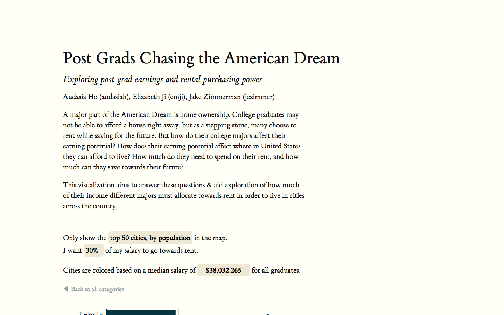

# Post-grads Chasing the American Dream

This repos is the result of work by Audi Ho, Elizabeth Ji, and Jake Zimmerman
for the course 05-499: Visualization in HCI at Carnegie Mellon University in
Spring 2017.

## Demos & Writeups

- :earth_americas: [Live Demo](https://itskirikins.github.io/post-grads/)

- :clipboard: [Initial proposal](proposal/proposal.md)

- :bar_chart: [Process book & final report](proposal/ProcessBook.pdf)

- :tv: [Video](https://itskirikins.github.io/post-grads/img/screencast-01.mp4):

## Overview

This project visualizes how affordable cities in the United States are for
college graduates. Viewers are able to see an overview of college majors and
their average salaries. Viewers are able to click through the majors, seeing the
average rent for cities in the United States on a map. By selecting what
percentage of the salary that a college graduate would like to contribute to
rent, the viewer can see what cities are affordable for that major, and what
cities are not.

Our process book can be found in the 'written' folder. All of our code and data
can be found on the 'gh-pages' branch.

We take our data from: FiveThirtyEight's [college major earnings
dataset](https://github.com/fivethirtyeight/data/tree/master/college-majors) and
Zillow's [rental dataset](https://www.zillow.com/research/data/#rental-data).

## License

MIT License. See LICENSE.
